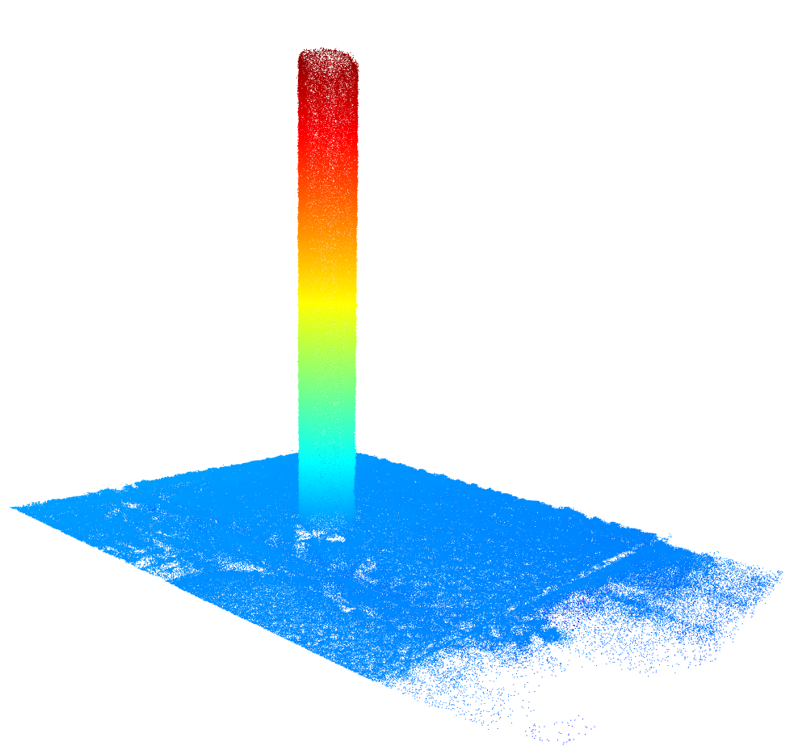

# nerf2dbh
<p align="center">
  
</p>
<p align="left">
  
  
</p>

## Getting started

Introducing ClickPoint 1.0, a portable GNSS/RTK data labeling tool. This firmware is intended for the wio terminal (ATSAMD51) and the ClickPoint 1.0 PCB. 
The devices allows for seven different custom labels. The firmware is a PlatformIO project, so you'll need to install [PlatformIO](https://platformio.org/) 
to update and reflash firmware.

## Configuration

ClickPoint is intended to receive RTCM3 correctional data from a base station using an RFD900 which directly streams the corrections to a ZEDF9P GNSS/RTK 
transciever. All the configuration for the ZEDF9P is handled in the firmware so it is plug and play. The RFD900 serial modem must be set up as a listener
in a multi-point network. The [manual](https://files.rfdesign.com.au/Files/documents/RFD900x%20Multipoint%20User%20Manual%20V1.1.pdf) describes how to use AT commands to configure a multi-point network. Use the following register configuration.

```
S1      57
S2      64
S3      0
S4      30
S6      0
S8      922000
S9      928000
S10     21
S11     100
S13     1
S14     80
S15     0
S24     x # the node number starting with the master (1) with a maximum in this case of (4) in a three-node, one-master configuration
S25     y # the address of the target node (1 for listener nodes, 255 for matser node)

Master-node specific settings (for base station RFD900 ONLY)
S24     1
S25     255
S26     1

AT&M0= 0, Z where Z is the maximum NodeID used e.g. (4) in a three node one master
configuration.
```

## Use

ClickPoint uses the up and down buttons on the wio terminal directional-pad to scroll over the labels. A double-press is used to write an entry to the SD card.
Data is appended to a file data.csv in the following format.

```
<lattitude,longitude,RTK_STAT,label>
<lattitude,longitude,RTK_STAT,label>
.
.
.
<lattitude,longitude,RTK_STAT,label>
```

RTK_STAT is an integer representing the rtk status of the positioning fix. It can be interpretted as follows.

```
RTK_STAT = 0 -> RTK_NONE
RTK_STAT = 1 -> RTK_FLOAT
RTK_STAT = 3 -> RTK_FIX
```

The user can see the current RTK status in the upper-right corner of the wio terminal display where red, yellow, green translates to RTK_NONE, RTK_FLOAT, RTK_FIX respectivley.

When the user makes a data entry, the current field will flash with the color representing the rtk status that is being recorded. 

ClickPoint uses custom user labels defined in a file called labels.txt which must be stored on the SD card. Keep in mind, the maximum label length is 30 characters.
Below is an example of a label definition file (labels.txt). Note that each label is seperated line-by-line.

```
data label 1
data label 2
data label 3
data label 4
data label 5
data label 6
data label 7
```

# Notes
- ClickPoint display will not start without ZEDF9P connected and properly formatted (FAT32) SD card inserted


